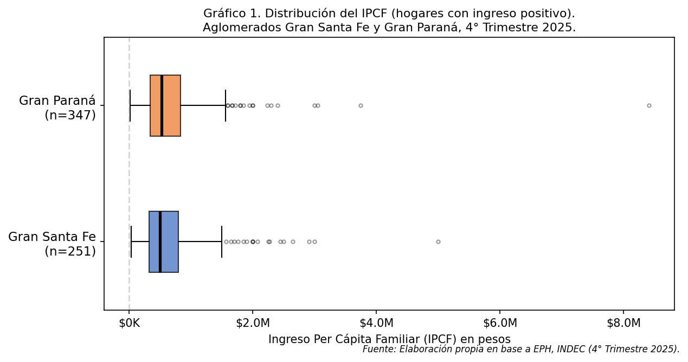
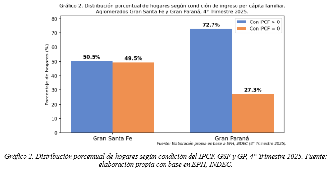
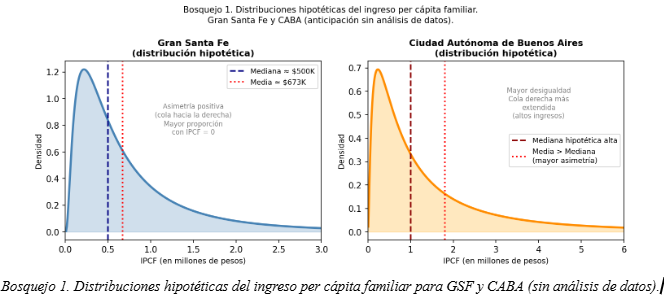

# Household Income Analysis — EPH (INDEC), Argentina

Statistical analysis of per capita family income (IPCF) in the Gran Santa Fe and Gran Paraná urban agglomerations, based on microdata from Argentina's Permanent Household Survey (EPH, INDEC), Q4 2025.

**Course:** Statistical Methods for the Social Sciences — Universidad Nacional del Litoral (FHUC-UNL), June 2026
**Authors:** Enzo Micheli, Santiago Grimmi, Fabricio Vera
**My role:** data processing and all charts, produced with Python (pandas / matplotlib).

## What the analysis covers

- **Descriptive statistics** of household per capita income (IPCF) for households with positive income: quartiles, mean, median, and coefficient of variation for both agglomerations (n = 251 for Gran Santa Fe, n = 347 for Gran Paraná).
- **Distribution analysis** with boxplots, identifying strong right skew and outliers in both income distributions (CV of 87.8% and 94.6%).
- **Cross-analysis with household size** (IX_TOT variable), linking larger households to lower per capita income.
- **Income–education inequality**: comparison of average schooling years between the lowest (Q1: 9.98 years) and highest (Q5: 14.81 years) income quintiles — a gap of nearly a full educational stage.
- **Critical reading of statistical claims**: identification of methodological errors in a sample report, including an incorrect claim of independence between income and schooling contradicted by the monotonic progression across quintiles.
- **Media interpretation**: analysis of income distribution figures (decile ratios, gender pay gap calculation) as reported in Argentine press.

## Data sources

- [EPH — Encuesta Permanente de Hogares](https://www.indec.gob.ar/indec/web/Institucional-Indec-BasesDeDatos), INDEC (Q4 2025, household database)
- [CEDLAS](https://www.cedlas.econo.unlp.edu.ar/wp/) — social indicators databases

## Repository contents

- `report/informe_TP2.pdf` — full report (in Spanish, 9 pages)
- `figures/` — charts produced with Python
- `scripts/bosquejo_lognormal.py` — log-normal density sketch comparing mean vs. median under positive skew (numpy + matplotlib)

## Tools

Python (pandas, numpy, matplotlib) · EPH/INDEC microdata
